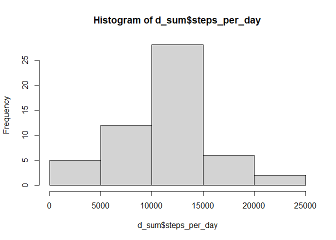
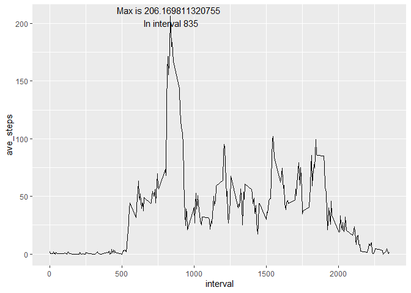
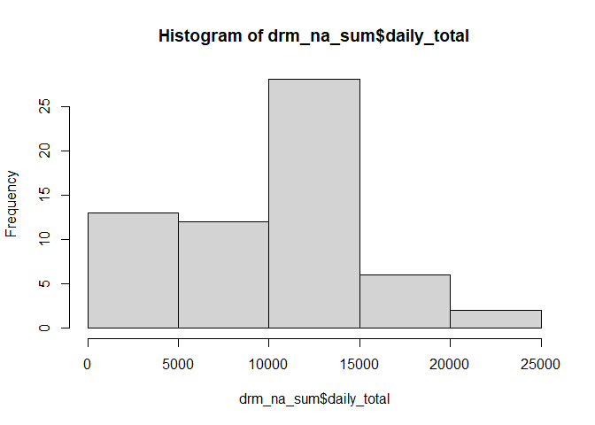
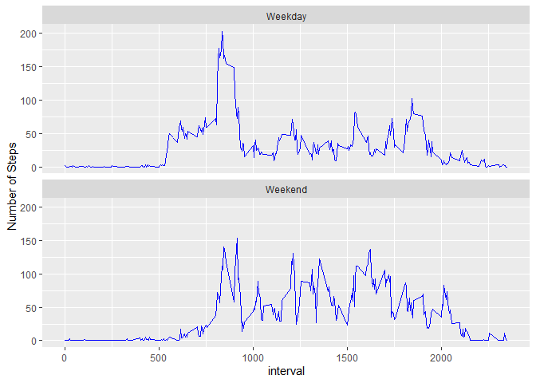

## Loading and preprocessing the data

```r
d <- read.csv("data/activity.csv")

library(dplyr)
```

```
## 
## Attaching package: 'dplyr'
```

```
## The following objects are masked from 'package:stats':
## 
##     filter, lag
```

```
## The following objects are masked from 'package:base':
## 
##     intersect, setdiff, setequal, union
```

```r
library(ggplot2)

d$date <- as.Date(d$date, "%Y-%m-%d")

head(d)
```

```
##   steps       date interval
## 1    NA 2012-10-01        0
## 2    NA 2012-10-01        5
## 3    NA 2012-10-01       10
## 4    NA 2012-10-01       15
## 5    NA 2012-10-01       20
## 6    NA 2012-10-01       25
```


## What is mean total number of steps taken per day?


```r
d_sum <- d %>% dplyr::group_by(date) %>% 
    dplyr::summarise(steps_per_day = sum(steps))

hist(d_sum$steps_per_day)
```

<!-- -->


```r
d_mean_med <- d %>% dplyr::group_by(date) %>% 
    dplyr::summarise(daily_mean = mean(steps, na.rm = TRUE),
                     daily_med = median(steps))

d_mean_med %>% knitr::kable(digits = 1)
```


|date       | daily_mean| daily_med|
|:----------|----------:|---------:|
|2012-10-01 |        NaN|        NA|
|2012-10-02 |        0.4|         0|
|2012-10-03 |       39.4|         0|
|2012-10-04 |       42.1|         0|
|2012-10-05 |       46.2|         0|
|2012-10-06 |       53.5|         0|
|2012-10-07 |       38.2|         0|
|2012-10-08 |        NaN|        NA|
|2012-10-09 |       44.5|         0|
|2012-10-10 |       34.4|         0|
|2012-10-11 |       35.8|         0|
|2012-10-12 |       60.4|         0|
|2012-10-13 |       43.1|         0|
|2012-10-14 |       52.4|         0|
|2012-10-15 |       35.2|         0|
|2012-10-16 |       52.4|         0|
|2012-10-17 |       46.7|         0|
|2012-10-18 |       34.9|         0|
|2012-10-19 |       41.1|         0|
|2012-10-20 |       36.1|         0|
|2012-10-21 |       30.6|         0|
|2012-10-22 |       46.7|         0|
|2012-10-23 |       31.0|         0|
|2012-10-24 |       29.0|         0|
|2012-10-25 |        8.7|         0|
|2012-10-26 |       23.5|         0|
|2012-10-27 |       35.1|         0|
|2012-10-28 |       39.8|         0|
|2012-10-29 |       17.4|         0|
|2012-10-30 |       34.1|         0|
|2012-10-31 |       53.5|         0|
|2012-11-01 |        NaN|        NA|
|2012-11-02 |       36.8|         0|
|2012-11-03 |       36.7|         0|
|2012-11-04 |        NaN|        NA|
|2012-11-05 |       36.2|         0|
|2012-11-06 |       28.9|         0|
|2012-11-07 |       44.7|         0|
|2012-11-08 |       11.2|         0|
|2012-11-09 |        NaN|        NA|
|2012-11-10 |        NaN|        NA|
|2012-11-11 |       43.8|         0|
|2012-11-12 |       37.4|         0|
|2012-11-13 |       25.5|         0|
|2012-11-14 |        NaN|        NA|
|2012-11-15 |        0.1|         0|
|2012-11-16 |       18.9|         0|
|2012-11-17 |       49.8|         0|
|2012-11-18 |       52.5|         0|
|2012-11-19 |       30.7|         0|
|2012-11-20 |       15.5|         0|
|2012-11-21 |       44.4|         0|
|2012-11-22 |       70.9|         0|
|2012-11-23 |       73.6|         0|
|2012-11-24 |       50.3|         0|
|2012-11-25 |       41.1|         0|
|2012-11-26 |       38.8|         0|
|2012-11-27 |       47.4|         0|
|2012-11-28 |       35.4|         0|
|2012-11-29 |       24.5|         0|
|2012-11-30 |        NaN|        NA|


```r
# Mean/Median total steps per day
summary(d_sum$steps_per_day)
```

```
##    Min. 1st Qu.  Median    Mean 3rd Qu.    Max.    NA's 
##      41    8841   10765   10766   13294   21194       8
```


## What is the average daily activity pattern?

```r
ave_int <- d %>% 
    group_by(interval) %>% 
    summarise(ave_steps = mean(steps, na.rm = TRUE)) %>% 
    ungroup()

ave_int %>% 
    ggplot(aes(interval, ave_steps)) +
        geom_line() +
        geom_text(data = subset(ave_int, ave_steps == max(ave_steps)), 
                  aes(label = paste("Max is", max(ave_int$ave_steps), "\n In interval", interval)))
```

<!-- -->


## Imputing missing values

```r
# NAs = 2304
summary(d)
```

```
##      steps             date               interval     
##  Min.   :  0.00   Min.   :2012-10-01   Min.   :   0.0  
##  1st Qu.:  0.00   1st Qu.:2012-10-16   1st Qu.: 588.8  
##  Median :  0.00   Median :2012-10-31   Median :1177.5  
##  Mean   : 37.38   Mean   :2012-10-31   Mean   :1177.5  
##  3rd Qu.: 12.00   3rd Qu.:2012-11-15   3rd Qu.:1766.2  
##  Max.   :806.00   Max.   :2012-11-30   Max.   :2355.0  
##  NA's   :2304
```

```r
# NAs are converted to 0, no daily medians where larger than 0 above
# Store in new drm_na variable
drm_na <- d
drm_na$steps[is.na(drm_na$steps)] <- 0L

drm_na_sum <- drm_na %>% group_by(date) %>% 
    summarise(daily_total = sum(steps))
```


The histogram distribution is more left skewed than when the NA values are removed.

```r
hist(drm_na_sum$daily_total)
```

<!-- -->


```r
summary(drm_na_sum$daily_total)
```

```
##    Min. 1st Qu.  Median    Mean 3rd Qu.    Max. 
##       0    6778   10395    9354   12811   21194
```
The mean and Median are lower when the NA entries are 0.


## Are there differences in activity patterns between weekdays and weekends?


```r
plot_data <- drm_na %>% 
    mutate(day = weekdays(date),
           type_of_day = if_else(day %in% c("Sunday", "Saturday"), "Weekend", "Weekday")) %>% 
    group_by(interval, type_of_day) %>% 
    summarise(`Number of Steps` = mean(steps))
```

```
## `summarise()` has grouped output by 'interval'. You can override using the `.groups` argument.
```

```r
plot_data %>% ggplot(aes(interval, `Number of Steps`)) +
    geom_line(color = "blue") +
    facet_wrap(~type_of_day, ncol = 1)
```

<!-- -->

